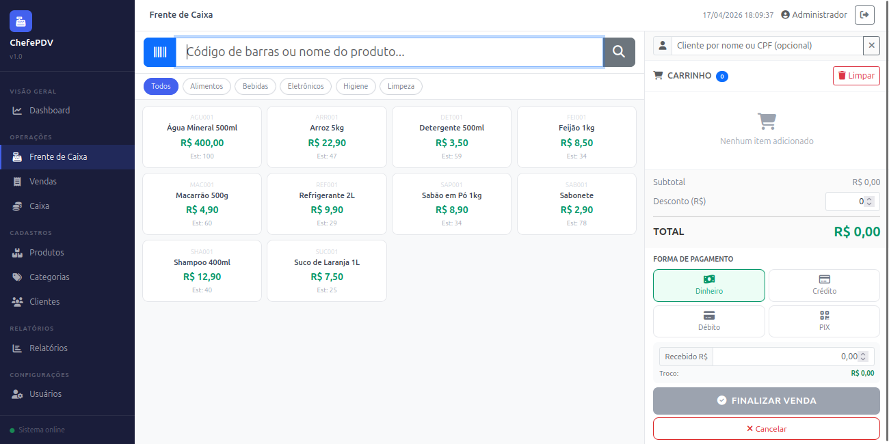
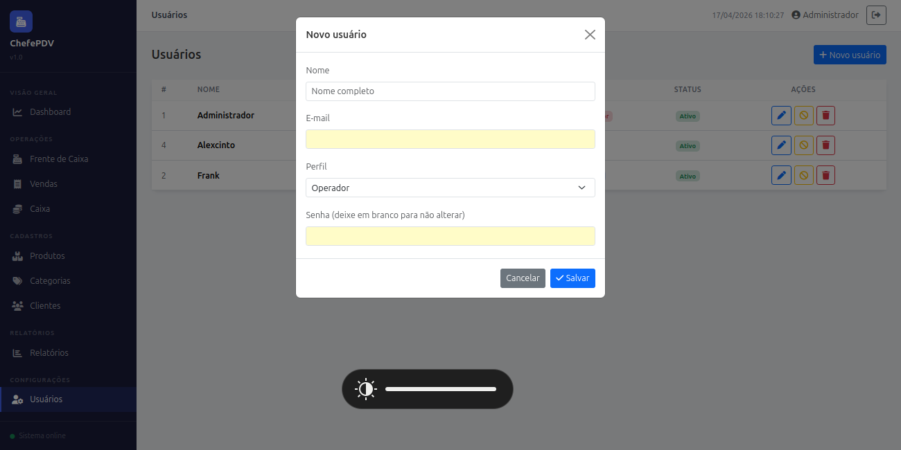

# ChefePDV


Sistema de ponto de venda desenvolvido em PHP puro, sem frameworks externos.

Grande parte do mercado de varejo brasileiro ainda opera com sistemas legados em PHP puro — sem framework, sem ORM, com jQuery no frontend. Quis entender esse modelo de ponta a ponta e construir algo nesse perfil, mas com arquitetura em camadas, segurança real e código que se sustenta. A restrição de não usar framework foi intencional: é o cenário que aparece na prática, e saber trabalhar dentro dele faz diferença.

O sistema cobre o fluxo completo de operação de um PDV: autenticação com controle de perfis, abertura de caixa, lançamento de itens, finalização com decremento atômico de estoque, cancelamento com estorno automático, relatórios gerenciais com exportação em PDF e integrações com APIs externas.

---

## Screenshots

| | |
|---|---|
|  |  |
|  |  |



---

## Funcionalidades

### Operações de Caixa
- Frente de caixa com busca de produtos por nome ou código de barras
- Finalização com dinheiro, crédito, débito e PIX — cada forma com validação específica
- Desconto por venda com cálculo automático de troco
- Cancelamento de venda com estorno de estoque em transação atômica
- Abertura e fechamento de caixa com comparativo entre saldo esperado e real

### Cadastros
- CRUD completo de produtos com estoque mínimo, categoria e código
- CRUD de clientes com CPF, CNPJ, endereço completo e telefone
- CRUD de categorias com vínculo aos produtos

### Relatórios
- **Geral** — dashboard com faturamento, ticket médio, cancelamentos, breakdown por pagamento, situação do estoque e top 5 produtos
- **Vendas** — histórico filtrável por período e forma de pagamento
- **Estoque** — situação por produto (OK, crítico, zerado) com destaque visual
- **Mais Vendidos** — ranking por quantidade vendida no período
- **Pagamentos** — distribuição de receita por forma de pagamento com percentual
- Exportação individual por aba ou combinada (múltiplas seções em um único PDF via `window.print()` com CSS de impressão dedicado)

### Gestão de Usuários
- CRUD de usuários com três perfis: **admin**, **gerente** e **operador**
- Controle de acesso aplicado tanto no sidebar quanto nas rotas — acesso direto via URL também é bloqueado
- Admin: acesso total. Gerente: tudo exceto usuários. Operador: frente de caixa e clientes

### Segurança
- Proteção contra SQL injection via PDO com `EMULATE_PREPARES = false`
- CSRF token em todos os formulários POST
- Rate limiting no login: bloqueio por IP após 5 tentativas em 15 minutos
- Senhas com `password_hash(PASSWORD_BCRYPT)` e verificação via `password_verify`
- Sessão com `httponly`, `samesite: Lax` e regeneração de ID no login
- Todos os endpoints AJAX validam sessão e perfil antes de processar

### Integrações Externas
- **ViaCEP** — preenchimento automático de endereço pelo CEP
- **ReceitaWS** — consulta de dados de empresa por CNPJ
- **BrasilAPI** — listagem dos próximos feriados nacionais no dashboard

---

## Arquitetura

Estrutura em camadas sem framework: cada requisição de página passa pelo `index.php`, que resolve a rota, verifica o perfil do usuário e carrega a view correspondente. Cada chamada AJAX vai para um endpoint em `api/`, que valida sessão e permissão via `Guard` antes de acionar o DAO.

```
pdv/
├── api/          Endpoints JSON (um arquivo por recurso)
├── config/       Database, Auth, Guard, Response, LoginRateLimiter
├── controller/   Validação de entrada e orquestração
├── dao/          Queries com PDO e prepared statements
├── model/        Entidades com fromArray()
├── service/      Integrações externas (ViaCEP, ReceitaWS, BrasilAPI)
├── view/         Templates PHP por módulo
└── assets/js/    Um arquivo JS por módulo (jQuery + AJAX)
```

### Fluxo de uma venda

```
Frente de caixa → api/pos.php → SaleController → SaleDAO::save()
                                                     ├── BEGIN TRANSACTION
                                                     ├── SELECT ... FOR UPDATE (lock de estoque)
                                                     ├── INSERT INTO vendas
                                                     ├── INSERT INTO venda_itens
                                                     ├── UPDATE estoque (decremento atômico)
                                                     └── COMMIT / ROLLBACK
```

O lock pessimista com `FOR UPDATE` garante que duas vendas simultâneas não decrementem o mesmo estoque duas vezes — problema clássico em PDVs com múltiplos terminais.

### Controle de acesso

```
index.php → verifica Auth::can($perfisPermitidos)
               ├── autorizado   → carrega view
               └── negado       → redireciona para /pos (frente de caixa)

api/*.php → Guard::requireAjax() → Guard::requireRole('admin', ...)
               ├── autorizado   → processa ação
               └── negado       → HTTP 403 + JSON de erro
```

---

## Como rodar

**Pré-requisito:** Docker e Docker Compose instalados.

```bash
git clone https://github.com/ItamarJuniorDEV/pdv-system-php.git
cd pdv-system-php

cp .env.example .env          # ajuste as variáveis se necessário
docker compose up -d
```

Acesse: [http://localhost:8081](http://localhost:8081)

| Perfil | E-mail | Senha |
|---|---|---|
| Administrador | admin@pdv.com | admin123 |

> O banco é inicializado automaticamente com categorias, produtos e o usuário admin na primeira execução.

---

## Stack

| Camada | Tecnologia |
|---|---|
| Backend | PHP 7.4+, PDO, sem framework |
| Banco | MySQL 8.0 |
| Frontend | Bootstrap 5, jQuery, AJAX |
| Infra | Docker, Apache |
| Testes | PHPUnit 9 |
