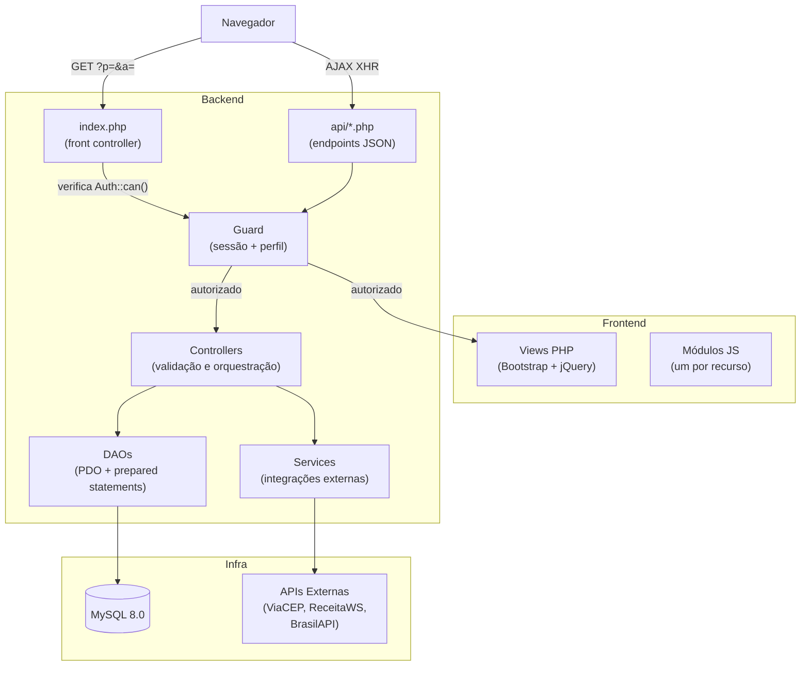
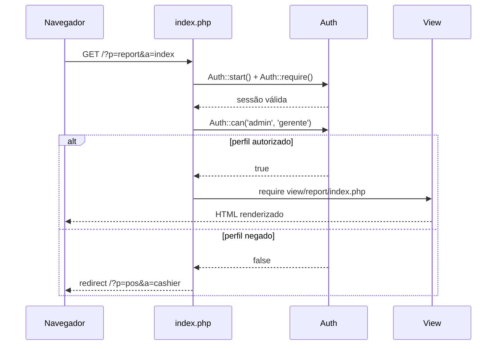
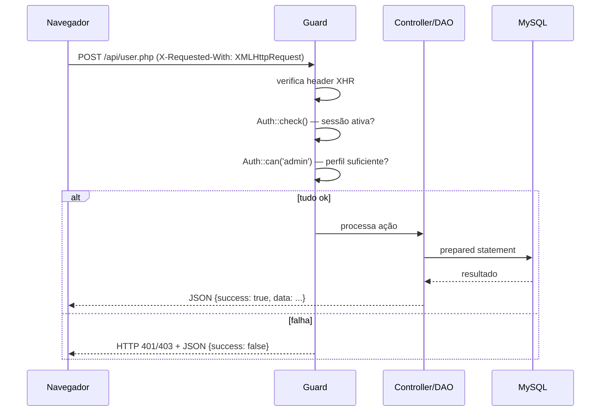

# Arquitetura

## Decisões de Design

### Sem framework

A restrição é intencional. O perfil tecnológico do projeto — PHP puro, jQuery, AJAX — é o que se encontra em sistemas reais de varejo no Brasil. Usar Laravel ou Symfony resolveria alguns problemas mas criaria outros: dependência de composer em produção, curva de aprendizado para manutenção, e distanciamento do objetivo do projeto, que é demonstrar domínio da camada mais baixa.

A ausência de framework exige estrutura explícita. A solução é uma arquitetura em camadas definida manualmente: front controller, endpoints JSON separados, DAOs com PDO, controllers para validação e orquestração.

### Front controller único

Toda requisição de página passa pelo `index.php`, que resolve `?p=` e `?a=`, verifica o perfil do usuário e carrega a view. Centralizar o roteamento aqui facilita o controle de acesso — a validação de perfil fica em um único ponto, não espalhada pelas views.

### Endpoints AJAX separados das views

Cada recurso tem um arquivo em `api/` que só retorna JSON. Eles não renderizam HTML e não compartilham código com as views. Isso permite testar os endpoints isoladamente e mantém a separação entre lógica de apresentação e lógica de negócio.

### DAO sem ORM

Queries ficam explícitas no código. Sem ORM, não há risco de N+1 queries escondidas atrás de um `->with()`, e o comportamento do banco é previsível. Para o porte desse sistema, ORM seria overhead sem benefício real.

---

## Visão de Componentes



---

## Fluxo de uma Requisição de Página



---

## Fluxo de uma Requisição AJAX



---

## Estrutura de Diretórios

```
pdv/
├── api/
│   ├── cashregister.php   abertura/fechamento de caixa
│   ├── category.php       CRUD de categorias
│   ├── customer.php       CRUD de clientes
│   ├── integrations.php   ViaCEP, ReceitaWS, BrasilAPI
│   ├── pos.php            operações da frente de caixa
│   ├── product.php        CRUD de produtos
│   ├── report.php         geração de relatórios
│   ├── sale.php           histórico e cancelamento de vendas
│   └── user.php           gestão de usuários
│
├── config/
│   ├── Auth.php           sessão, login, perfil, CSRF
│   ├── Config.php         carregamento do .env
│   ├── Database.php       singleton PDO
│   ├── Guard.php          proteção de endpoints
│   ├── LoginRateLimiter.php  bloqueio por IP
│   └── Response.php       padronização de JSON
│
├── controller/
│   ├── ProductController.php
│   ├── CategoryController.php
│   ├── CustomerController.php
│   └── SaleController.php
│
├── dao/
│   ├── CashRegisterDAO.php
│   ├── CategoryDAO.php
│   ├── CustomerDAO.php
│   ├── DashboardDAO.php
│   ├── ProductDAO.php
│   ├── ReportDAO.php
│   ├── SaleDAO.php
│   └── UserDAO.php
│
├── service/
│   ├── BrasilApiService.php
│   ├── ReceitaWsService.php
│   └── ViaCepService.php
│
├── view/
│   ├── layout/            header, footer, sidebar
│   ├── cashregister/
│   ├── customer/
│   ├── dashboard/
│   ├── pos/
│   ├── product/
│   ├── report/
│   ├── sale/
│   └── user/
│
├── assets/
│   ├── css/style.css
│   ├── js/                um arquivo por módulo
│   └── img/
│
├── docs/                  documentação técnica
├── docker-compose.yml
├── banco.sql
└── index.php              front controller
```
