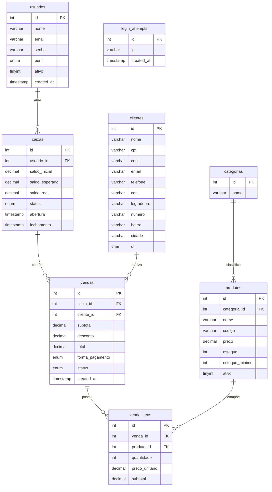

# Banco de Dados

## Decisões de Modelagem

**MySQL 8.0** pelo suporte a `SELECT ... FOR UPDATE` com lock de linha, necessário para o controle de estoque em vendas concorrentes. Com múltiplos terminais de caixa operando ao mesmo tempo, dois operadores podem tentar vender o último item em estoque simultaneamente. O lock pessimista garante que apenas uma das transações prossiga — a outra faz rollback.

**`EMULATE_PREPARES = false`** no PDO força o MySQL a interpretar os parâmetros da query, eliminando a possibilidade de SQL injection mesmo em edge cases do driver PHP.

**Preço gravado na venda, não referenciado do produto.** O campo `preco_unitario` em `venda_itens` registra o valor no momento da venda. Uma alteração de preço futura no cadastro do produto não deve distorcer o histórico de vendas passadas.

**Vendas canceladas não são apagadas.** O campo `status` em `vendas` aceita `concluida` ou `cancelada`. O registro é mantido para auditoria — o estoque é estornado, mas o histórico fica íntegro.

---

## Diagrama ER

---

## Descrição das Tabelas

### `usuarios`
Operadores do sistema. O campo `perfil` define o nível de acesso: `admin`, `gerente` ou `operador`. Usuários com `ativo = 0` não conseguem fazer login — a query de autenticação filtra por esse campo.

### `caixas`
Cada turno de trabalho gera um registro. `saldo_esperado` é calculado pelo sistema com base nas vendas do turno; `saldo_real` é o que o operador conta fisicamente no fechamento. A diferença entre os dois fica registrada para análise do gerente.

### `vendas`
Registro central de cada transação. O `cliente_id` é opcional — nem toda venda precisa de cliente identificado. O `caixa_id` vincula a venda ao turno em que ela ocorreu.

### `venda_itens`
Itens de cada venda com preço unitário gravado no momento da transação. Isso preserva a integridade histórica independentemente de reajustes futuros no cadastro de produtos.

### `login_attempts`
Tabela de suporte ao rate limiting. Registra IP e timestamp de cada tentativa falha. O `LoginRateLimiter` conta entradas dos últimos 15 minutos por IP e bloqueia após 5 tentativas.
