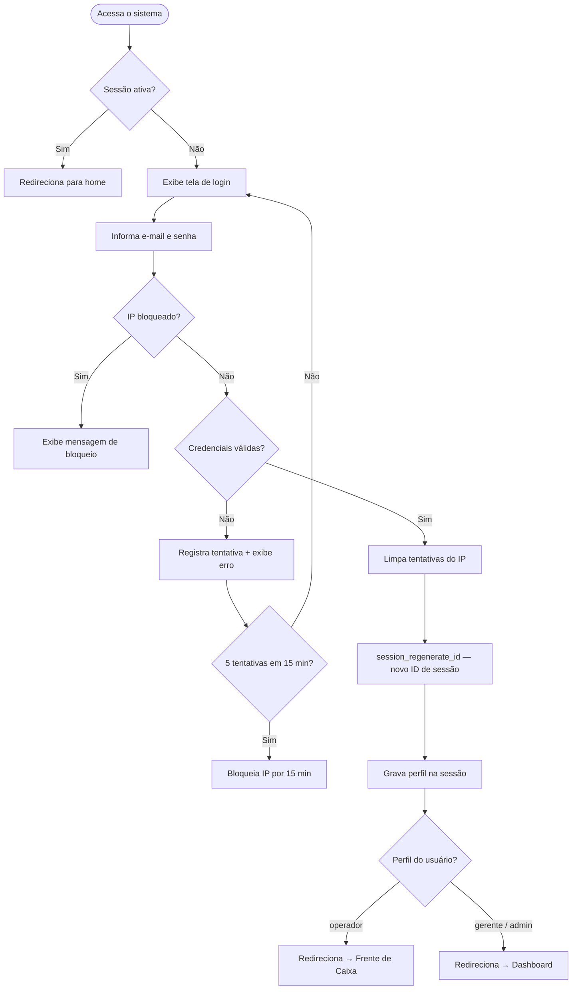
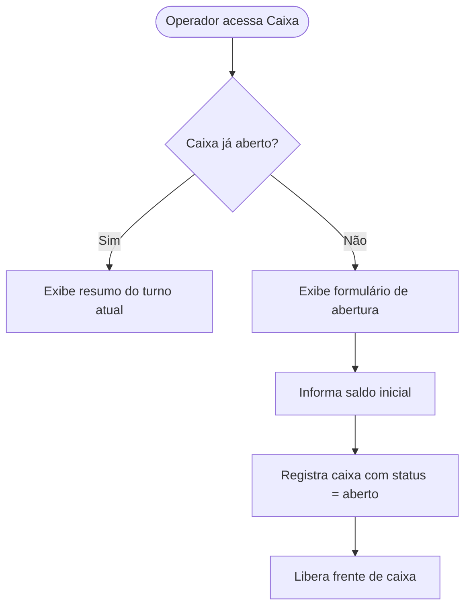
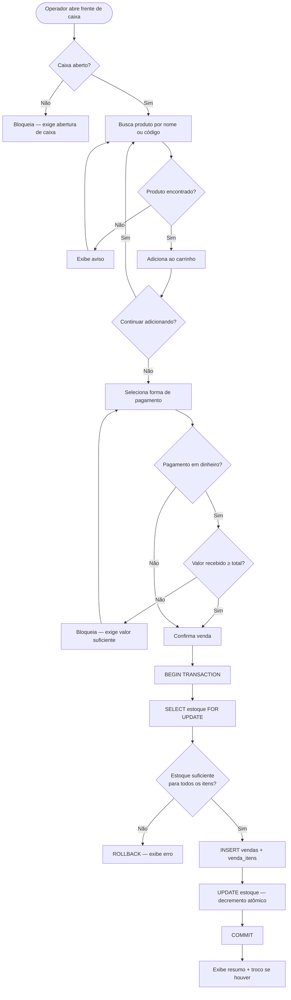
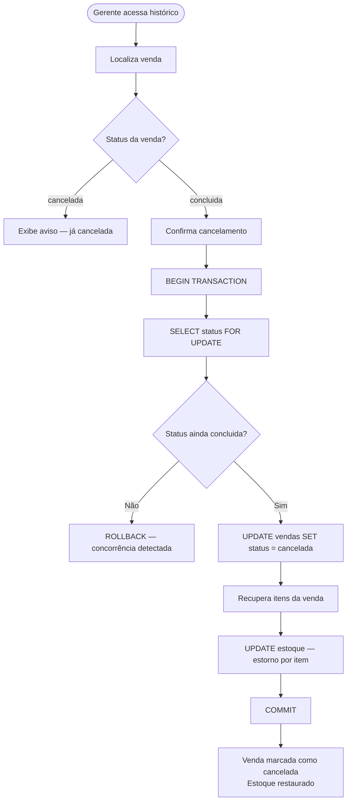
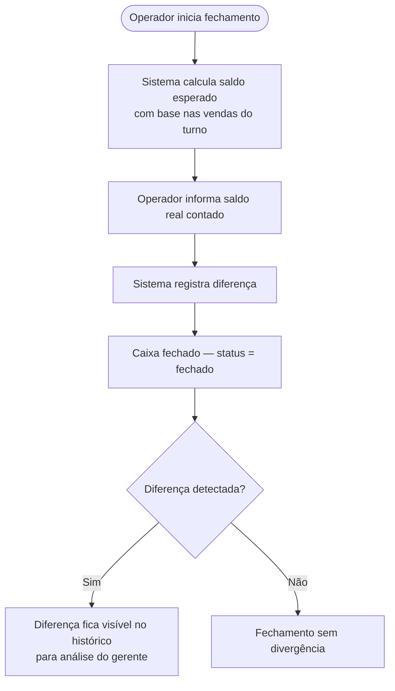
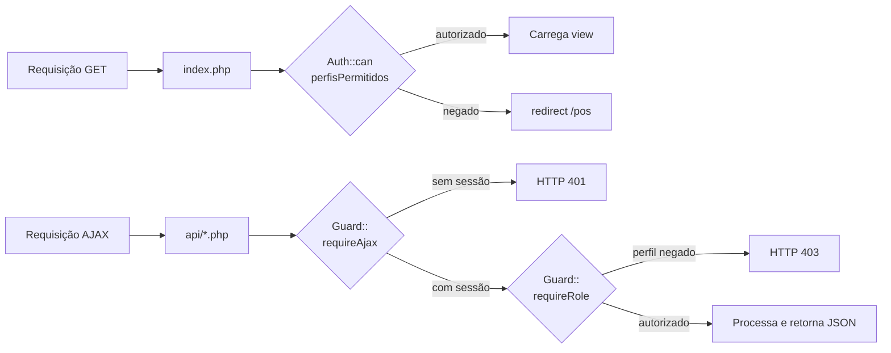

# Fluxos do Sistema

## Fluxo de Autenticação

---

## Fluxo de Abertura de Caixa

---

## Fluxo de uma Venda

---

## Fluxo de Cancelamento de Venda

---

## Fluxo de Fechamento de Caixa

---

## Fluxo de Controle de Acesso por Rota

